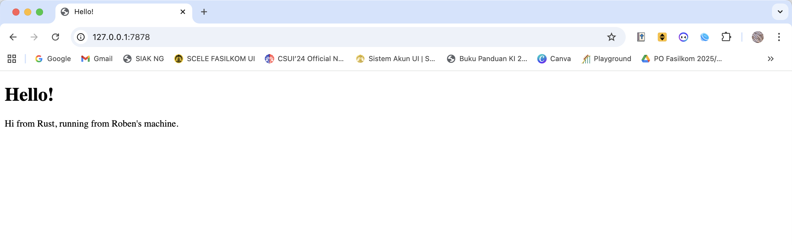
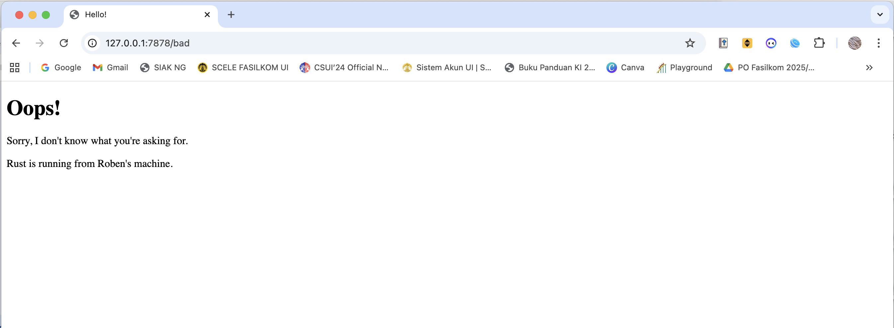

## Commit 1 Reflection notes

In this milestone, the `handle_connection` function is responsible for reading the incoming TCP stream. It wraps the stream in a `BufReader` to buffer the reads, making it more efficient than reading byte by byte. The code then reads the incoming HTTP request line by line, mapping each result and stopping when it encounters an empty line, which signifies the end of the HTTP request headers. The collected lines are then printed to the console so we can inspect the raw HTTP request sent by the browser.

## Commit 2 Reflection notes

The updated `handle_connection` function now actively responds to the client instead of just printing the request. It constructs a valid HTTP response by defining a status line (`HTTP/1.1 200 OK`) and reading the contents of `hello.html` into a string. It then calculates the byte length of the HTML content to set the `Content-Length` header. Finally, it formats these components into a standard HTTP response string and writes it back to the TCP stream as bytes, allowing the browser to render the HTML page. 

## Commit 3 Reflection notes

The refactoring in this milestone introduces routing to our web server. By reading just the first line of the HTTP request, the server can determine exactly what the client is asking for. We use an `if/else` block (or `match`) to check if the request line is exactly `GET / HTTP/1.1`. If it is, the server responds with the `200 OK` status and the `hello.html` file. For any other request, it selectively responds with a `404 NOT FOUND` status and a `404.html` error page. This split is necessary so that the server behaves correctly according to HTTP standards, rather than blindly returning the same page regardless of the requested URL.

## Commit 4 Reflection notes

The `/sleep` route simulates a slow, heavy operation by pausing the thread for 10 seconds. Because our current server is single-threaded, it processes incoming connections sequentially. When a request hits the `/sleep` endpoint, the entire main thread halts. If a second request comes in (even to the fast `/` route) while the server is sleeping, it must wait in line until the first 10-second request finishes. This clearly demonstrates the major bottleneck of single-threaded architecture: a single slow request blocks all other users from accessing the server.

## Commit 5 Reflection notes

To solve the blocking issue, I implemented a `ThreadPool` to handle concurrency. Instead of spawning a brand-new thread for every single request (which could overwhelm the system and lead to a Denial of Service), the thread pool creates a fixed number of worker threads waiting for tasks. I use a channel (`mpsc`) to send closures (jobs) from the main thread to the workers. To allow multiple workers to safely listen to the same receiver, I wrap it in an `Arc<Mutex<Receiver>>`. Now, when a slow request comes in, one worker handles it, leaving the other workers instantly available to process subsequent requests concurrently.

## Commit 6 Reflection notes

The original `ThreadPool::new` function used an `assert!(size > 0)` macro. If someone accidentally passed `0` as the pool size, the program would instantly panic and crash the entire application. By refactoring this to `ThreadPool::build` and returning a `Result`, we follow better Rust idioms. Returning a `Result` allows the caller to handle the error gracefully (e.g. logging the error and falling back to a default size) rather than causing a fatal crash.